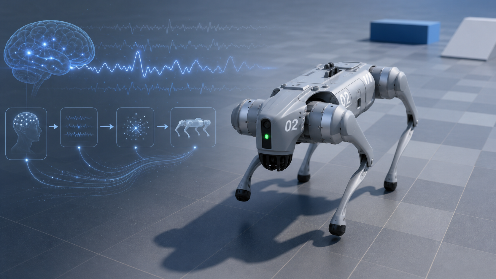

# 🧠 2026 Intro2BMI MuJoCo Project

A hands-on project for learning Brain–Machine Interface (BMI) through controlling a quadruped robot in MuJoCo.



---

## 🚀 Overview

This project connects neural signal decoding with embodied robot control:


EEG → decoding → motion command → robot locomotion


The motion command can be a discrete direction such as forward/left/right, or a continuous velocity command such as `[vx, vy, yaw]`.

## Run Simple MuJoCo Keyboard Control

```bash
conda create -n bmi_mujoco python=3.10
conda activate bmi_mujoco
```

```bash
pip install --upgrade pip
pip install mujoco numpy scipy torch pygame pyyaml opencv-python
pip install -e Go2Py-main
```

Run:

```bash
mjpython bmi_mujoco_keyboard_control/simple_mujoco_keyboard_control.py
```

Keyboard:

```text
w      forward
s      backward
a      turn left
d      turn right
q      move left
e      move right
space  stop
x      exit
```

## Details

Installation package sources:

- MuJoCo: https://github.com/google-deepmind/mujoco
- Go2Py: https://github.com/machines-in-motion/Go2Py
